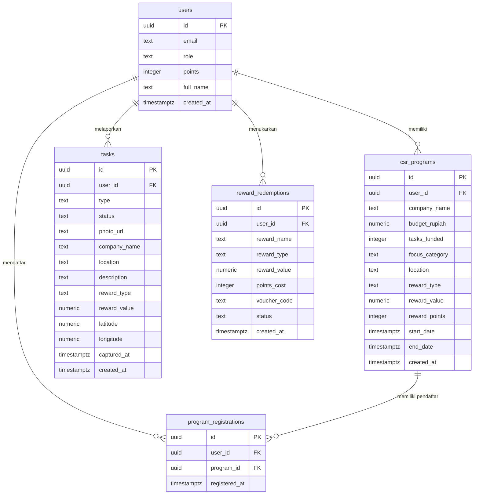

# 🛣️ Jalan (Jaringan Relawan)

<p align="center">
  
</p>

**Jalan (Jaringan Relawan)** — sebelumnya dikenal sebagai _WaktuJaga_ — adalah sebuah platform digital berbasis web kustom **Cash-for-Work** dan **ESG (Environmental, Social, and Governance) Dashboard** yang dirancang khusus untuk menghubungkan inisiatif aksi sosial/mitigasi lingkungan dari warga secara transparan dengan pendanaan CSR (Corporate Social Responsibility) dari perusahaan.

Aplikasi ini menyederhanakan penyaluran bantuan sosial/insentif bagi relawan (_Safety Net_) dan memberikan visualisasi dampak nyata bagi korporasi yang mendanai inisiatif tersebut melalui metrik ESG terstandarisasi dan visualisasi geospasial (peta sebaran aksi relawan).

---

## 🚀 Fitur Utama

### 🧑‍🤝‍🧑 1. Sisi Warga (Volunteer & Cash-for-Work)

- **Sistem Pendaftaran Aksi CSR:** Warga dapat meninjau program-program CSR aktif yang didanai oleh berbagai perusahaan dan mendaftarkan diri secara langsung pada program tersebut sebelum melakukan aksi lapangan.
- **Laporan Tugas berbasis Kamera & GPS Terverifikasi:** Warga mengirimkan bukti penyelesaian aksi sosial secara real-time. Dilengkapi dengan:
  - _Selfie Camera Integration:_ Warga harus mengambil foto langsung menggunakan kamera depan (Selfie) untuk memastikan kehadiran fisik di lokasi.
  - _Geolocation Proofing:_ Penandaan koordinat GPS (latitude dan longitude) secara otomatis saat pengambilan gambar untuk mencegah kecurangan (fraud).
  - _Hari-H Mechanism:_ Form pengiriman tugas dikunci dan hanya terbuka pada rentang tanggal pelaksanaan program CSR (`start_date` s.d. `end_date`) setelah warga mendaftar.
- **Saldo Safety Net (Poin Kebaikan):** Setiap laporan aksi yang disetujui akan mendatangkan poin reward. Warga dapat memantau saldo poin mereka secara real-time.
- **Voucher & Reward Store:** Warga dapat menukarkan poin reward kebaikan mereka dengan berbagai kebutuhan pokok darurat:
  - 🌾 **Voucher Paket Sembako** (Tukar 12.000 Poin)
  - ⚡ **Token Listrik PLN & BPJS Kesehatan** (Tukar 18000 Poin)
  - 📱 **Cash Out E-Wallet (DANA/OVO/GoPay)** (Tukar 25.000 Poin)
- **Riwayat Klaim Voucher:** Transaksi penukaran poin langsung menghasilkan kode voucher unik (misal: `JLN-XXXX-YYYY`) yang disimpan dalam tab "Voucher Saya".

### 🏢 2. Sisi Corporate (B2B & ESG Dashboard)

- **Pembuatan Program CSR Terperinci:** Korporasi dapat membuat inisiatif CSR baru dengan menentukan total anggaran (budget rupiah), kategori fokus, lokasi target, nilai reward per tugas, serta rentang tanggal acara (mulai & selesai).
- **Peninjauan & Verifikasi Manual:** Corporate dapat melihat foto bukti tugas warga, membaca deskripsi laporan, melihat koordinat lokasi, dan menyetujui (`Approved`) atau menolak (`Rejected`) secara manual.
- **Dashboard ESG & Sustainability Metrics:** Menampilkan metrik dampak sosial dan kepatuhan lingkungan secara real-time:
  - _Total Warga Terbantu:_ Jumlah relawan dengan aksi disetujui.
  - _Aksi Mitigasi Berhasil:_ Jumlah akumulatif tugas mitigasi kebencanaan dan kebersihan lingkungan yang diselesaikan.
  - _Estimasi Anggota Keluarga Terbantu:_ Multiplier berbasis indeks BPS (1 warga = 3,9 anggota keluarga) untuk menggambarkan seberapa besar jaring pengaman sosial telah menyebar.
  - _Skor ESG:_ Algoritma kalkulasi baseline kepatuhan sosial yang mengevaluasi rasio efisiensi mitigasi dan jangkauan warga.
- **Unduh Laporan ESG (PDF Export):** Memungkinkan perusahaan mencetak ringkasan program CSR, metrik keberlanjutan, area kerja, serta log aktivitas relawan langsung ke dokumen cetak/PDF dengan sekali klik.
- **Visualisasi Geospasial (Peta Interaktif & Heatmap):** Mengintegrasikan data koordinat GPS dari tugas-tugas warga untuk menampilkan:
  - _Marker Map:_ Pin lokasi detail yang menampilkan foto bukti dan detail tugas relawan saat diklik.
  - _Heatmap Visual:_ Peta intensitas aksi untuk menganalisis kepadatan kontribusi sosial di wilayah tertentu.
  - _Filtering Lanjutan:_ Filter visualisasi peta berdasarkan Program, Kategori Tugas, dan Status Verifikasi.

### ⚙️ 3. Simulasi Automasi & Webhook

- **Webhook `/api/trigger-automation`:** Endpoint khusus yang mensimulasikan pemrosesan n8n/Make.com untuk mengevaluasi tugas berstatus `pending`. Algoritma pencocokan akan mencari program CSR yang relevan, memotong anggaran program sebesar nilai reward ditambah **12% Platform Fee**, memperbarui saldo poin warga, dan mengubah status tugas menjadi `approved`.

---

## 🛠️ Tech Stack & Dependencies

Aplikasi dibangun menggunakan teknologi modern yang sangat efisien dan interaktif:

- **Framework Utama:** [TanStack Start](https://tanstack.com/start) (React 19 + Vite + Server Functions / API Routes) untuk memfasilitasi Server-Side Rendering (SSR) dan routing berkemampuan tinggi.
- **Data Fetching & State:** [TanStack Query (React Query)](https://tanstack.com/query) untuk melakukan caching data dinamis secara instan dan efisien.
- **Database & Backend as a Service:** [Supabase](https://supabase.com) (PostgreSQL, Supabase Auth, & Supabase Storage untuk penyimpanan foto tugas warga).
- **Peta Geospasial:** [Leaflet](https://leafletjs.com/) & [React Leaflet](https://react-leaflet.js.org/) ditambah plugin [Leaflet.heat](https://github.com/Leaflet/Leaflet.heat) untuk visualisasi sebaran geospasial berbasis kepadatan.
- **Styling & UI:** Tailwind CSS, Radix UI (shadcn/ui), Lucide Icons, dan Framer Motion (untuk animasi transisi antarmuka yang dinamis dan premium).
- **Manajemen Animasi:** GSAP & @gsap/react.

---

## 🗄️ Skema Database (PostgreSQL / Supabase)

Berikut adalah struktur tabel inti yang mendasari relasi data di platform **Jalan**:



### Penjelasan Relasi & Logika:

1.  **`public.users`:** Meng-extend tabel bawaan `auth.users` Supabase. Memiliki trigger otomatis `on_auth_user_created` yang akan memasukkan email dan role default `warga` ketika pendaftaran pertama kali terdeteksi di modul Auth.
2.  **`public.tasks`:** Menyimpan laporan dari warga. Menyertakan bidang GPS (`latitude`, `longitude`, `captured_at`) untuk merekam metadata foto asli.
3.  **`public.program_registrations`:** Menjembatani pendaftaran warga ke program CSR tertentu demi memvalidasi hak pengiriman tugas pada Hari-H.
4.  **`public.reward_redemptions`:** Mencatat voucher belanja kebutuhan dasar yang diklaim warga menggunakan Poin Kebaikan / Saldo Safety Net yang berhasil mereka kumpulkan.

---

## ⚙️ Cara Menjalankan Project Secara Lokal

### Prasyarat

- [Node.js](https://nodejs.org/) versi 18 ke atas.
- [pnpm](https://pnpm.io/) sebagai pengelola paket utama.

### Langkah 1: Kloning & Instalasi Dependensi

```bash
git clone https://github.com/YudaClairee/safety-garudahacks.git
cd safety-garudahacks
pnpm install
```

### Langkah 2: Konfigurasi Environment Variables

Buat file bernama `.env.local` di direktori akar proyek Anda:

```env
VITE_SUPABASE_URL=https://[PROJECT-ID].supabase.co
VITE_SUPABASE_ANON_KEY=[YOUR-ANON-KEY]
```

### Langkah 3: Menjalankan Server Pengembangan (Local Dev)

```bash
pnpm dev
```

Aplikasi Anda akan berjalan di [http://localhost:3000](http://localhost:3000).

### Langkah 4: Menjalankan Pengujian & Standardisasi Kode

- **Pemeriksaan Tipe & Linting:**
  ```bash
  pnpm lint
  pnpm check
  ```
- **Format Otomatis:**
  ```bash
  pnpm format
  ```
- **Menjalankan Unit Test (Vitest):**
  ```bash
  pnpm test
  ```

---

## 🧪 Panduan Pengujian Alur (Golden Flow)

Ikuti langkah-langkah di bawah ini untuk mensimulasikan fungsionalitas platform Jalan secara lengkap:

1.  **Daftar Warga:**
    - Buka [http://localhost:3000/login](http://localhost:3000/login) dan daftarkan akun baru (akun pertama akan menjadi Warga secara default).
    - Anda akan masuk ke **Dashboard Warga**. Di sini, Anda akan melihat saldo poin Anda masih `0` dan belum memiliki voucher.
2.  **Daftar/Login Corporate & Buat Program:**
    - Buka database Supabase Anda atau daftarkan akun khusus corporate (atau ubah role akun Anda di tabel `public.users` menjadi `corporate`).
    - Login kembali menggunakan akun corporate tersebut, Anda akan masuk ke **Dashboard CSR**.
    - Klik **+ Program Baru** dan isi formulir program CSR: masukkan anggaran (misal: Rp 10.000.000), tentukan kategori (misal: "Membersihkan lingkungan"), masukkan lokasi target, tentukan reward value (misal: 50.000 poin), serta atur rentang tanggal pelaksanaan.
3.  **Warga Mendaftar & Mengirim Bukti Tugas (Hari-H):**
    - Kembali ke akun **Warga**.
    - Di bagian form lapor tugas, pilih opsi dropdown program CSR milik corporate yang baru saja dibuat.
    - Jika program belum dimulai/belum didaftari, klik tombol **"Daftar Aksi Sekarang"**.
    - Setelah berhasil terdaftar dan berada di hari pelaksanaan, form pelaporan akan terbuka.
    - Gunakan kamera aktif (atau upload file cadangan) untuk mengambil foto tugas, ketik lokasi spesifik dan deskripsi tugas, lalu klik **Kirim Laporan**. Status tugas baru Anda akan menjadi **Pending**.
4.  **Menjalankan Automasi / Webhook:**
    - Untuk memproses tugas tertunda tersebut secara instan, Anda bisa kembali ke **Dashboard Corporate** lalu klik tombol **"Simulasi Webhook Otomasi"**.
    - Secara alternatif, Anda dapat mengirimkan permintaan HTTP POST/GET langsung ke endpoint `/api/trigger-automation`.
    - Periksa data: status tugas warga akan berubah menjadi **Approved**, anggaran program corporate terpotong, dan saldo warga bertambah sebesar 50.000 poin.
5.  **Penukaran Voucher:**
    - Kembali ke **Dashboard Warga**, klik **Tukar Safety Net**.
    - Pilih opsi penukaran voucher (misal: "Voucher Paket Sembako" seharga 12.000 poin).
    - Kode voucher unik baru Anda akan terbit di bagian "Voucher Saya" dan saldo poin Anda akan terpotong secara otomatis.
6.  **Ekspor ESG Laporan:**
    - Di **Dashboard Corporate**, tinjau perubahan metrik ESG (jumlah warga terbantu, estimasi keluarga terbantu, area kerja yang dinamis).
    - Klik tombol **Download ESG Report (PDF)** untuk mengunduh dokumen laporan resmi keberlanjutan yang rapi dan siap cetak.

---

## 🔒 Row Level Security (RLS) & Produksi

Sebagai catatan proyek ini disiapkan untuk demonstrasi Hackathon MVP, sehingga beberapa kebijakan RLS sengaja diatur agar dapat diubah demi kelancaran proses simulasi webhook tanpa memerlukan service role key yang kompleks di sisi klien. Untuk peluncuran ke tahap produksi, sangat direkomendasikan untuk memperketat kebijakan RLS pada tabel `public.tasks` dan `public.csr_programs` serta mengisolasi pemanggilan database server-side menggunakan Service Role API Key rahasia di dalam Server Functions TanStack Start.
